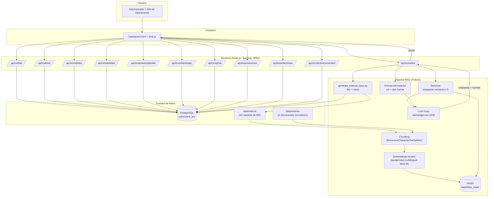

# Arquitectura de la Solución - Asistente RAG SalmoSUR S.A.

## Diagrama de arquitectura (Mermaid)



## Diagrama de integración (ASCII - vista general)

```
┌───────────────────────┐
│      USUARIO          │
│  (dashboard/chats)    │
└──────────┬────────────┘
           │  pregunta en lenguaje natural
           ▼
┌───────────────────────┐
│  BACKEND (Express)    │
│  POST /api/consultar  │
└──────────┬────────────┘
           │
           ▼
┌───────────────────────────────────────────────────────────────┐
│                PIPELINE RAG (Python)                           │
│                                                               │
│   ┌──────────┐    ┌──────────┐    ┌──────────┐    ┌────────┐ │
│   │ FAISS    │◄───│ Embeddings│◄───│ Chunking │◄───│Datos   │ │
│   │ (índice) │    │ (local)   │    │          │    │internos│ │
│   └────┬─────┘    └──────────┘    └──────────┘    │externos│ │
│        │                                          └────────┘ │
│        ▼                                                    │
│   ┌──────────┐    ┌─────────────┐                          │
│   │ Retriever│───▶│ LLM (Groq)  │                          │
│   │  (k=5)   │    │ gpt-oss-120b│                          │
│   └──────────┘    └──────┬──────┘                          │
│                          ▼                                 │
│                 respuesta + fuentes (JSON)                  │
└──────────────────────────┬──────────────────────────────────┘
                           │
                           ▼
┌──────────────────────────────────────────────┐
│          DASHBOARD (Frontend)                │
│   muestra respuesta + chips de fuente        │
└──────────────────────────────────────────────┘
```

## Componentes y justificación

| Componente | Tecnología | Justificación |
|------------|------------|---------------|
| **Frontend** | HTML + Tailwind + Chart.js | Se integra al dashboard existente (mismo estilo y stack); cero fricción para el usuario final |
| **Backend** | Node.js + Express | Reutiliza la infraestructura actual del sistema de gestión (mismo patrón de endpoints) |
| **Vector Store** | FAISS (local) | Gratuito, sin API key, rápido para corpus pequeño (22-35 chunks); se guarda en `data/faiss_index/` |
| **Embeddings** | `paraphrase-multilingual-MiniLM-L12-v2` (local) | Groq no ofrece embeddings; modelo multilingüe apto para español; 384 dims = poco espacio y búsquedas rápidas; los datos no salen de la máquina (privacidad) |
| **LLM** | Groq `openai/gpt-oss-120b` | Capa gratuita, baja latencia, sin tarjeta de crédito; permite consultas de bajo volumen dentro del límite diario de 100K tokens |
| **Chunking** | `RecursiveCharacterTextSplitter` (size=600, overlap=80) | Preserva contexto semántico por chunk; el ajuste de tamaño 600 mejoró la recuperación (7/7 pruebas vs 3/7 inicial) |
| **Prompt** | Sistema con reglas (rol, citar fuente, "no sé") | Controla alucinaciones y garantiza trazabilidad de cada dato respondido |

## Flujo de datos (dos rutas)

1. **Ingesta (una vez por actualización de datos):**
   PostgreSQL (`ventas`, `cosechas`, `lotes`, `centros`, `empleados`, `inventario`, `compras`, `exportaciones`, `lotes_detalle`, `incidentes`) → `scripts/generate_internal_docs.py` → `data/interna/*.txt` (10 reportes, cada uno con sumario ejecutivo)
   Documentos normativos → `data/externa/*.txt`
   Ambos → Chunking → Embeddings → `FAISS.save_local(data/faiss_index)`

2. **Consulta (por cada pregunta del usuario):**
   Pregunta → retriever busca en FAISS (k=5) → 5 chunks relevantes → prompt (sistema + contexto + pregunta) → LLM → respuesta + fuentes → /api/consultar → dashboard.

## Decisiones de diseño clave

- **Separación de fuentes internas/externas:** los documentos `interna/` vienen de la BD (datos operativos) y `externa/` de normativa (Sernapesca, mercado). El RAG las indexa por separado pero las recupera de forma unificada, lo que permite combinar "dato" + "recomendación normativa" en una sola respuesta.
- **Sumarios ejecutivos en los reportes internos:** cada documento de `data/interna/` inicia con un sumario que enuncia los datos salientes (máximo de planilla, proveedor mayor, mejor FCR, alertas de stock…). Así las consultas puntuales recuperan la conclusión en el primer chunk y las respuestas son precisas (14/14 pruebas).
- **Descarga del LLM:** El LLM solo actúa sobre el contexto recuperado, forzado por el prompt. Esto evita alucinaciones: cuando no hay datos, responde "No tengo información suficiente".
- **Trazabilidad:** cada chunk guarda metadata `fuente`; el LLM cita la fuente y el frontend la muestra como chips.