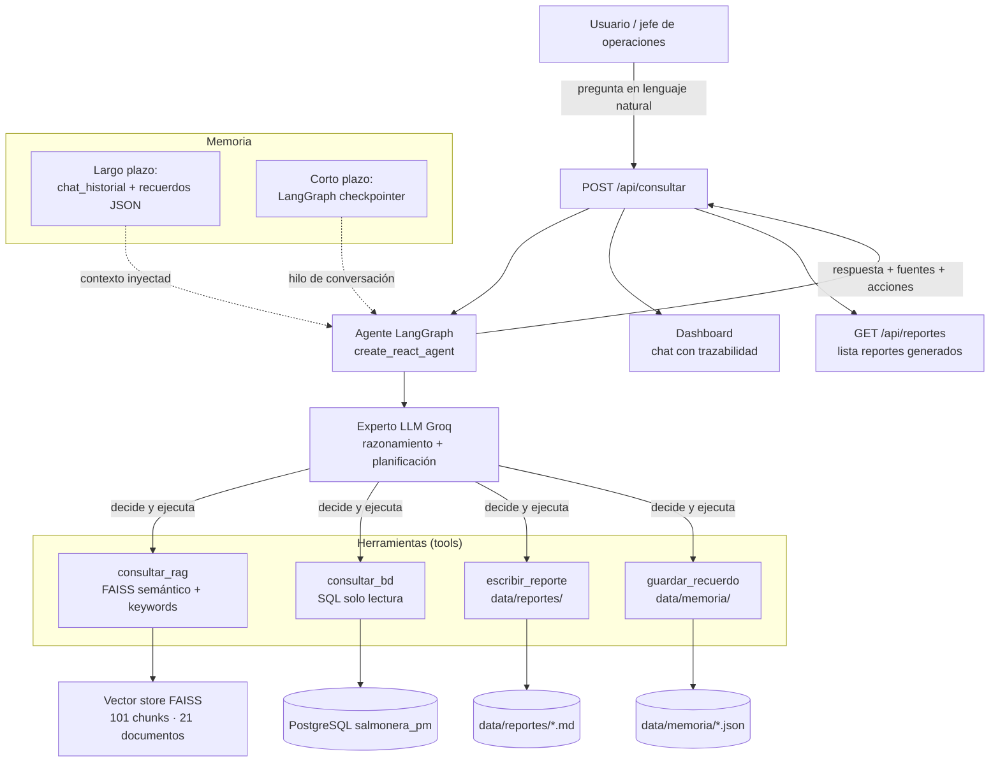

# Arquitectura de la Solución — Agente Funcional SalmoSUR S.A. (EP2)

> Proyecto ISY0101 · Evaluación Parcial 2 · Desarrollo de un **Agente Funcional** con
> consulta, escritura y razonamiento, memoria y planificación (LangGraph).

## 1. Diagrama de orquestación del agente (Mermaid)


```mermaid
flowchart TD
    U[Usuario / jefe de operaciones] -->|pregunta en lenguaje natural| API[POST /api/consultar]
    API --> AG[Agente LangGraph<br/>create_react_agent]
    AG --> RX[Experto LLM Groq<br/>razonamiento + planificación]

    subgraph HERRAMIENTAS["Herramientas (tools)"]
        RAG[consultar_rag<br/>FAISS semántico + keywords]
        BD[consultar_bd<br/>SQL solo lectura]
        REP[escribir_reporte<br/>data/reportes/]
        MEM[guardar_recuerdo<br/>data/memoria/]
    end

    RX -->|decide y ejecuta| RAG
    RX -->|decide y ejecuta| BD
    RX -->|decide y ejecuta| REP
    RX -->|decide y ejecuta| MEM

    subgraph MEMORIA["Memoria"]
        LP[Largo plazo:<br/>chat_historial + recuerdos JSON]
        CP[Corto plazo:<br/>LangGraph checkpointer]
    end

    RAG --> VOC[Vector store FAISS<br/>101 chunks · 21 documentos]
    BD --> PG[(PostgreSQL salmonera_pm)]
    REP --> FILES[(data/reportes/*.md)]
    MEM --> FILES2[(data/memoria/*.json)]

    LP -.contexto inyectado.-> AG
    CP -.hilo de conversación.-> AG

    AG -->|respuesta + fuentes + acciones| API --> D[Dashboard<br/>chat con trazabilidad]
    API --> REP2[GET /api/reportes<br/>lista reportes generados]
```

## 2. Ciclo de decisión del agente (ReAct)

```
1. Router/intención → el experto LLM analiza la pregunta.
2. Selecciona y ejecuta herramienta(s):
     - pregunta de negocio o normativa  → consultar_rag
     - cruce / cálculo sobre cifras      → consultar_bd
     - pedido de informe/documentación   → escribir_reporte
     - dato personal a recordar          → guardar_recuerdo
3. Racionaliza los resultados (razonamiento multi-paso).
4. Responde citando fuente, o declara "No tengo información suficiente".
```

## 3. Componentes y justificación

| Componente | Tecnología | Rol / justificación |
|------------|------------|---------------------|
| **Framework de agentes** | **LangGraph** (`create_react_agent`) | Orquestación ReAct con grafo de estados; escalable a grafos custom y compatible con el stack LangChain existente (ie2) |
| **Herramientas** | `@tool` de LangChain | Envuelven capacidades específicas (consulta BD, RAG, escritura, memoria) y las exponen al LLM como JSON-schema (ie1) |
| **Consulta semántica** | FAISS + embeddings locales | Recuperación vectorial con metadata de fuente; los datos no salen de la máquina (ie4) |
| **Consulta a BD** | `psycopg2` (solo SELECT) | Respuestas con cifras verificables cruzando vistas del sistema de gestión |
| **Escritura** | `data/reportes/` + `GET /api/reportes` | El agente genera reportes Markdown visibles/descargables (ie1: escritura) |
| **Memoria corto plazo** | `InMemorySaver` (checkpointer) | Hilo de conversación dentro de una ejecución multi-paso |
| **Memoria largo plazo** | `chat_historial` (PostgreSQL) + `data/memoria/*.json` | Re-inyección de interacciones pasadas y recuerdos persistentes al inicio de cada llamada (ie3) |
| **LLM** | Groq `openai/gpt-oss-120b` | Motor de razonamiento, temp 0.1, `max_tokens=2000` |
| **Frontend** | dashboard + `chat.js` | Muestra respuesta, fuentes y **trazabilidad del agente** (herramientas usadas en cada turno) |

## 4. Flujo de datos

### 4.1 Ingesta (una vez por actualización de datos)

```
PostgreSQL (17 tablas) ──generate_internal_docs.py──▶ data/interna/ (14 reportes)
                                                       data/externa/ (7 normativos)
                                                                     │
                                                     chunking (600/80) → embeddings locales → FAISS (101 chunks)
```

### 4.2 Consulta (por cada turno del usuario)

```
pregunta ─▶ server.js ─▶ subproceso agente_salmosur.py ─▶ memoria LP inyectada
     ─▶ agente LangGraph (ReAct) ─▶ decide herramienta(s) ─▶ respuesta+fuentes+acciones
     ─▶ guarda en chat_historial ─▶ dashboard (chat + trazabilidad + reportes)
```

## 5. Decisiones de diseño clave (EP2)

- **Reemplazo del pipeline lineal por un agente**: `/api/consultar` invoca el agente
  LangGraph en vez del RAG pasivo; misma interfaz JSON (respuesta + fuentes) + `acciones`
  (trazabilidad de decisiones).
- **Memoria dual**: corto plazo (checkpointer por hilo) y largo plazo (historial por
  usuario + recuerdos persistidos). Cada turno nuevo re-inyecta el historial del usuario
  para mantener continuidad en flujos prolongados (ie3).
- **Varias herramientas en una misma tarea**: el agente puede encadenar
  `consultar_rag` → `consultar_bd` → `escribir_reporte` en una sola respuesta, lo que
  demuestra planificación multi-etapa (ie5/ie6).
- **Anti-alucinación preservado**: regla "No tengo información suficiente" y citación
  de fuente se mantienen en el prompt del agente.