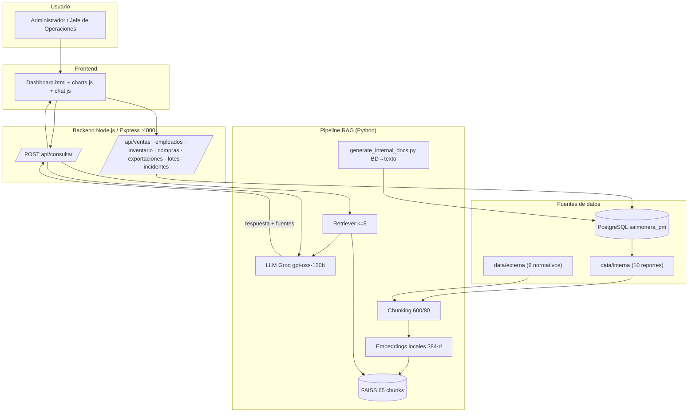

# Informe Técnico — Asistente IA con RAG para SalmoSUR S.A.

**Evaluación Parcial N°1 · Diseño de Solución con LLM y RAG**

| Dato | Valor |
|------|-------|
| **Sigla** | ISY0101 |
| **Asignatura** | Ingeniería de Soluciones con IA |
| **Institución** | Duoc UC |
| **Tiempo asignado** | 2 horas pedagógicas (ponderación 30%) |
| **Integrante 1** | *[Nombre Integrante 1 — sección] — completar* |
| **Integrante 2** | *[Nombre Integrante 2 — sección] — completar* |
| **Fecha** | Septiembre 2026 |
| **Repositorio** | https://github.com/yenyag/Salmonera_PM · rama `int/ia` |

---

## Declaración de uso de IA (obligatoria)

Este proyecto utilizó herramientas de IA como **apoyo en redacción, revisión de código y generación de diagramas** (GitHub Copilot/assistentes de código, asistentes de texto). **Las decisiones técnicas, el diseño de la solución, los análisis y las conclusiones fueron elaborados y validados por el equipo**, y las reflexiones individuales fueron redactadas sin apoyo de IA. Todo contenido generado con IA fue revisado y contrastado con la documentación del curso. (`https://bibliotecas.duoc.cl/ia`)

---

## A. Análisis del caso organizacional (IE1)

**Organización.** SalmoSUR S.A., empresa chilena de producción y comercialización de salmón, con centros de cultivo en Los Lagos, Chiloé, Quellón y Aysén. Dispone de un sistema de gestión en línea (PostgreSQL + dashboard web).

**Problema identificado.** La información operativa (ventas, mortalidad, biomasa, planilla, stock, exportaciones, incidentes) y la normativa del sector (Sernapesca, bioseguridad, requisitos de exportación) se consultan por separado. Cada consulta exige navegar el dashboard y contactar a TI, con tiempos de 15 a 30 minutos y sin trazabilidad del origen del dato.

**Objetivos de la intervención.**
1. Responder consultas operativas en lenguaje natural en **menos de 1 minuto**.
2. Respuestas **fundamentadas en datos internos y normativa externa**, con **citación de la fuente** de cada dato.
3. Integrar la solución en el **dashboard existente** sin modificar el flujo de trabajo del equipo.
4. Evitar **alucinaciones**: cuando el dato no exista en las fuentes, el asistente debe declarar que no tiene información.

**Datos disponibles.** PostgreSQL con 12 tablas (`ventas`, `cosechas`, `lotes`, `centros`, `empleados`, `inventario`, `proveedores`, `compras`, `exportaciones`, `lotes_detalle`, `incidentes`, `usuarios`), más 6 documentos normativos del sector.

**Requerimientos de la solución con IA:** consulta en lenguaje natural, recuperación simultánea de fuentes internas y externas, trazabilidad, control de contexto, e integración al sistema web existente.

---

## B. Formulación de prompts (IE2)

El prompt del sistema (`scripts/query_rag.py`) sigue la estructura clásica **rol → contexto → pregunta**, con reglas explícitas de control de calidad:

```
Eres el asistente interno de la empresa SalmoSUR S.A. …
REGLAS OBLIGATORIAS:
1. Responde ÚNICAMENTE con la información contenida en el CONTEXTO RECUPERADO.
2. Si la pregunta no puede responderse con el contexto, responde textualmente:
   "No tengo información suficiente para responder eso."
3. Cita la fuente de cada dato al final de tu respuesta: [Fuente: <archivo>]
4. Usa cifras y fechas exactas de los datos. No inventes ni redondees.
5. Responde en español, de forma clara y concisa.
6. Si te preguntan por recomendaciones, basalas únicamente en los datos del contexto.
7. Si la pregunta pide enumerar, respóndela COMPLETA con todos los elementos.

CONTEXTO RECUPERADO: {contexto}
```

**Justificación de elementos clave.**

| Elemento | Decisión | Fundamento |
|----------|----------|------------|
| Rol explícito | "Asistente interno de SalmoSUR" | Alinea tono, vocabulario y dominio; técnica de rol + tarea |
| Regla 1 (solo contexto) | Barrado anti-alucinación | El LLM no conoce los datos de la empresa; limita la generación a datos reales |
| Regla 2 (no sé) | Manejo de dato ausente | Evita inventar cifras si el retriever no recupera evidencia (IE4) |
| Regla 3 (citar fuente) | Trazabilidad | Cada dato es verificable por el usuario desde su origen |
| Regla 4 (cifras exactas) | Precisión numérica | Evita redondeos/errores típicos de LLM |
| Regla 7 (enumerar completo) | Exhaustividad | Evita respuestas truncadas en listas (requisitos, productos, lotes) |
| `{contexto}` separado | Una variable por consulta | Distingue dato vs regla; el contexto proviene del retriever (k=5) |
| Temperatura 0.1 | Baja | Respuestas deterministas y consistentes con las fuentes |

---

## C. Diseño e implementación del pipeline RAG (IE3, IE4)

**Flujo de ingesta (una vez por actualización de datos).**

```
PostgreSQL ──generate_internal_docs.py──▶ data/interna/ (10 reportes con sumario ejecutivo)
                                                               │
data/externa/ (6 documentos normativos) ───────────────────────┤
                                                               ▼
                               RecursiveCharacterTextSplitter (600 / solap. 80)
                                                               ▼
                              Embeddings locales paraphrase-multilingual-MiniLM-L12-v2 (384 dims)
                                                               ▼
                                              FAISS.save_local(data/faiss_index)
```

- **Fuente interna:** 10 reportes generados desde las vistas PostgreSQL (ventas, calidad, mortalidad, rentabilidad, empleados, inventario, compras, exportaciones, lotes detallados, incidentes). Cada reporte inicia con un **sumario ejecutivo** que enuncia los datos salientes (máximo de planilla, proveedor mayor, mejor FCR, alertas de stock, etc.) para que las consultas puntuales recuperen la conclusión en el primer chunk.
- **Fuente externa:** normativa chilena del sector (Sernapesca, bioseguridad, requisitos y calidad de exportación, mercado del salmón, accidentes laborales / Ley 16.744).
- **Chunking:** tamaño 600 caracteres con solapamiento 80 (ajuste validado empíricamente: elevó la coherencia de las pruebas).
- **Embeddings:** modelo multilingüe local (384 dimensiones) — los datos **no salen de la máquina**.
- **Índice:** FAISS con 16 documentos y 65 chunks.

**Flujo de consulta (por pregunta del usuario).**

```
pregunta → retriever FAISS (k=5, + recuperación ampliada por keywords de dominio)
         → max 8 chunks → prompt (sistema + contexto + pregunta)
         → LLM Groq openai/gpt-oss-120b → respuesta + [Fuente: …] → POST /api/consultar
```

**Recuperación ampliada por keywords.** Cuando la pregunta menciona un módulo con datos reales
(incidentes, inventario/stock, proveedor, exportaciones, planilla, lote, FCR), `query_rag.py` refuerza
el contexto con esos chunks aunque la similitud los deje fuera del top-k. Esto corrigió la pregunta
compleja multi-tabla (ver §E) **sin subir k** y **sin anular el anti-alucinación** (las keywords
excluyen términos de seguridad/emergencia como "accidente"/"emergencia").

**Coherencia dato → respuesta (IE4).** Se implementó un evaluador heurístico (`scripts/run_pruebas.py`) que normaliza texto y verifica que los tokens de interés aparezcan en la respuesta y que el asistente **cite al menos una fuente**; para preguntas sin dato, exige la respuesta literal del "no sé". Resultado actual:

### Resultado de pruebas de coherencia — **14/14**

| Bloque | Preguntas | Fuentes usadas |
|--------|-----------|----------------|
| Datos internos | P1–P4, P8–P14 | mortalidad, ventas, rentabilidad, calidad, empleados, inventario, compras, exportaciones, lotes_detalle, incidentes (.txt) |
| Interna + externa | P5 | mortalidad (interna) + bioseguridad / sernapesca (externa) |
| Dato externo | P6 | exportacion_calidad (externa) |
| Sin dato (anti-alucinación) | P7 | ninguna (responde "No tengo información suficiente") |

Evidencia completa con respuestas literales en `pruebas/resultados.md`.

### Medición de chunks y consumo de tokens (IE3, IE7)

Prueba reproducible con `python scripts/medir_chunks_tokens.py` (reporte completo en `pruebas/medicion_chunks_tokens.txt`).

| Métrica | Valor |
|---------|-------|
| Chunks indexados | **65** (45 internos + 20 externos) |
| Documentos indexados | 16 (10 internos + 6 externos) |
| Contexto recuperado por consulta | 5 chunks por similitud (~2 000 caracteres) + hasta 3 refuerzos por keywords en preguntas de módulos específicos |
| Tokens por consulta (promedio) | **1 115** (entrada ≈ 870, salida ≈ 246) |

| Total en 14 consultas | Tokens |
|-----------------------|--------|
| Entrada (prompt) | 12 174 |
| Salida (completion) | 3 441 |
| **Total de la prueba** | **15 615** |
| En caché (contexto repetido) | 2 560 (21 % del prompt) |
| De razonamiento | 2 115 (61 % de la salida) |

- **Latencia media:** 1,13 s por consulta (Groq, `openai/gpt-oss-120b`, temperature 0.1, max_tokens 1500).
- **Proyección de costo:** con el límite diario de la capa gratuita de Groq (100 000 tokens), caben ≈ 90 consultas como las de la batería.

### Pruebas operativas: sanitarias, estrés y accidente laboral (IE3, IE4, IE9)

Se ejecutaron tres baterías adicionales para validar el comportamiento del sistema en operación, cuyos reportes completos quedan como evidencia en `pruebas/`.

**Pruebas sanitarias (salud del sistema) — 100 % OK.** `node pruebas/sanitarias.cjs` verificó: dashboard y login (200 / 401), los 15 endpoints de módulos respondiendo 200 con datos, `/api/consultar` devolviendo dato + fuentes (y 400 sin pregunta), las 7 tablas del modelo con registros (25 empleados, 22 ítems de inventario, 18 incidentes, etc.), la vista de incidentes y el índice FAISS con 65 chunks. Evidencia: `pruebas/resultados_sanitarias.txt`.

**Escenario de accidente laboral — 9/9 preguntas coherentes.** `python scripts/prueba_accidente.py` (Groq, k=5) midió el consumo real y la reacción ante un accidente: ante datos verificables responde con cifras exactas y fuente (4 accidentes; 2 críticos tipo escape; severidades bajo 4 / medio 6 / alto 6 / crítico 2); ante consultas de procedimiento entrega medidas accionables (control de acceso, desinfección, manejo de mortalidades, activar contingencia y notificar a Sernapesca); y ante datos legales/contactos responde la normativa chilena (números de emergencia 131/132/133, Ley 16.744 y su cobertura por mutualidad/ISL). Un caso deliberadamente sin dato (accidentes fatales registrados) mantiene el **"No tengo información suficiente"** sin inventar —decisión clave en una emergencia. Tokens: **10 281 totales, promedio 1 142/consulta**. Evidencia: `pruebas/resultados_accidente.md` y `pruebas/analisis_preguntas_estres_accidente.md`.

**Prueba de estrés.** `node pruebas/estres.cjs`:
- **REST:** 45/45 peticiones OK en 3 ráfagas simultáneas (p95 ≤ 85 ms, sin errores).
- **RAG en secuencia:** 10/10 respuestas correctas con 10 461 tokens (promedio 1 046/consulta, latencia media 1,75 s).
- **RAG en paralelo (10 simultáneas):** 2/10 OK y 8/10 HTTP 500 a ~16,5 s. **Causa:** cada consulta lanza un subproceso Python que carga el modelo de embeddings en la GPU (RTX 3050, 4 GiB de VRAM); con varias simultáneas la VRAM se agota (`torch.OutOfMemoryError`) y el servidor responde 500. El servidor no se cae (memoria del proceso estable) y sigue atendiendo el REST.
- **Acción implementada:** semáforo de concurrencia (máx. 2 subprocesos simultáneos) en `server.js` para encolar consultas bajo carga en lugar de fallar. Re-ejecución del estrés paralelo: 8/10 OK, 0 HTTP 500 (2 timeout de cola, no fallo del servidor).

**Pregunta compleja multi-tabla — resuelta.** Una consulta que cruza 3-5 dominios (mortalidad + incidentes + inventario + rentabilidad) no reunía todos los chunks en el top-5 (los de `incidentes.txt` e `inventario.txt` quedaban fuera del ranking y el asistente respondía "No tengo información suficiente"). Se amplió el corpus (detalle de accidentes/críticos en el reporte interno + documento externo de accidentes laborales → 65 chunks) y se añadió la **recuperación ampliada por keywords** en `query_rag.py`: la pregunta integra ahora la mortalidad del LOTE-B2, los 2 escapes críticos y las recomendaciones de bioseguridad, citando fuentes (2 153 tokens). Se conserva la recuperación por similitud y el anti-alucinación (no se amplía con términos de seguridad/emergencia). Evidencia: `pruebas/analisis_pregunta_compleja.md`.

---

## D. Arquitectura de la solución (IE5, IE6)



**Componentes clave y su rol.**

| Componente | Tecnología | Rol en la operación |
|------------|------------|---------------------|
| Frontend | HTML + Tailwind + Chart.js | Dashboard con 16 paneles (gráficos + tablas) y chat flotante del asistente |
| Backend | Node.js + Express | 19 endpoints REST + `POST /api/consultar` que ejecuta el pipeline RAG |
| Fuente interna | PostgreSQL → `data/interna/` | Datos operativos transformados a texto para su indexación |
| Fuente externa | `data/externa/` | Normativa del sector para recomendaciones con respaldo |
| Vector store | FAISS (local) | Búsqueda por similitud sobre embeddings |
| Generación | Groq `openai/gpt-oss-120b` | Compendio final fundamentado en el contexto recuperado |

**Flujo de datos:** ruta de ingesta (BD → reportes → chunks → embeddings → FAISS) y ruta de consulta (pregunta → retriever → prompt → LLM → respuesta con fuentes → dashboard). Los datos no abandonan la máquina en la fase de embedding.

---

## E. Justificación de decisiones de diseño (IE7, IE8)

| Decisión | Alternativas | Justificación (objetivos organizacionales) |
|----------|--------------|---------------------------------------------|
| **FAISS** en vez de Chroma/Pinecone | Pinecone (nube, pago), Chroma | Corpus pequeño (65 chunks): FAISS es gratuito, local y suficiente; evita costos y la salida de datos |
| **Embeddings locales** | OpenAI embeddings (pago, externo) | Groq no ofrece embeddings; el modelo multilingüe local garantiza privacidad y costo cero |
| **Groq gpt-oss-120b** | OpenAI, Anthropic | Capa gratuita, baja latencia; el volumen de consultas cabe en el límite diario (≈90 consultas/día con la configuración actual) |
| **Chunk 600 / overlap 80** | Tamaños 300 y 900 | 600 con overlap preserva contexto y mejora recuperación (validado: coherencia subió en las pruebas) |
| **k=5** | k=3, k=7 | Equilibrio costo/precisión: las consultas puntuales (1-2 dominios) se responden exactas; con k=5 se ahorran tokens frente a k=7. La pregunta compleja multi-tabla se resolvió con la **recuperación ampliada por keywords** (refuerza el contexto cuando la pregunta menciona un módulo) en vez de subir k |
| **RAG vía subproceso Python por consulta** | Pool persistente de workers | Simple de integrar con el dashboard Node.js; hallazgo del estrés: la carga simultánea del modelo de embeddings satura la VRAM de la GPU (RTX 3050 4 GiB) → 500 en paralelo; **mitigación implementada**: semáforo con máx. 2 subprocesos (validado: 8/10 OK sin errores 500) |
| **Prompt con reglas + "no sé"** | Prompt libre | Controla alucinaciones y garantiza trazabilidad (IE4) |
| **Sumario ejecutivo por reporte** | Reportes planos | La conclusión queda en el primer chunk y las consultas puntuales se responden con exactitud |
| **Vistas SQL** | Consultas ad-hoc | Reutilizables para API y reportes RAG; fuente única de verdad |

---

## F. Redacción técnica y evidencias (IE9)

- **Lenguaje:** descripción precisa de componentes (retriever, índice vectorial, embeddings, chunking) y cifras exactas de la validación.
- **Evidencia empírica:** 14/14 pruebas de coherencia con citación de fuentes (reproducción: `python scripts/run_pruebas.py`, ver `pruebas/resultados.md`).
- **Evidencia de medición:** 65 chunks en el índice actual (medición original: 57 chunks, 15 615 tokens consumidos en 14 consultas, promedio 1 115/consulta; detalle en `pruebas/medicion_chunks_tokens.txt`, reproducible con `python scripts/medir_chunks_tokens.py`).
- **Evidencia de pruebas operativas:** sanitarias 100 % OK (`pruebas/resultados_sanitarias.txt`); accidente laboral 9/9 con 10 281 tokens (`pruebas/resultados_accidente.md`); estrés REST 45/45 y RAG 10/10 en secuencia con 10 461 tokens, pero 2/10 en paralelo por límite de VRAM (`pruebas/resultados_estres.txt`); análisis pregunta por pregunta y cruce multi-tabla resuelto (`pruebas/analisis_preguntas_estres_accidente.md`, `pruebas/analisis_pregunta_compleja.md`).
- **Evidencia de integración:** login (`admin@salmonera.com`), dashboard, 16 paneles con gráficos/tablas y 11 endpoints de módulos respondiendo HTTP 200; asistente respondiendo con `[Fuente: …]` dentro del dashboard.

### Comandos para reproducir (desde `README.md`)

```bash
PGPASSWORD=salmonera123 psql -h localhost -U salmonera -d salmonera_pm -f db/schema_modulos.sql
python scripts/generate_internal_docs.py     # BD → 10 reportes
python scripts/build_index.py                # → índice FAISS
python scripts/run_pruebas.py                # → 14/14 pruebas
python scripts/medir_chunks_tokens.py       # → 65 chunks, tokens por consulta
python scripts/prueba_accidente.py          # → 9/9 accidente laboral + tokens
node pruebas/sanitarias.cjs                 # → sanitarias (100 % OK)
node pruebas/estres.cjs                     # → estrés REST + RAG (SVR_PID=<pid>)
npm install && npm start                     # servidor http://localhost:4000
```

---

## Conclusiones y reflexiones individuales

> **Nota de la rúbrica:** conclusiones, justificaciones técnicas y reflexiones individuales deben redactarse **sin apoyo de IA**.

### Reflexión individual — Integrante 1
*[Redactar aquí, sin IA: qué aprendí sobre prompts, RAG, arquitectura y qué aporté al proyecto.]*

### Reflexión individual — Integrante 2
*[Redactar aquí, sin IA: qué aprendí sobre la integración LLM + recuperación y qué aporté al proyecto.]*

### Conclusión del equipo
*[Redactar aquí, sin IA: síntesis de hallazgos, limitaciones (límites de cuota, corpus simulado) y proyección (más fuentes, agentes autónomos, índices híbridos).]*

---

## G. Referencias (formato APA)

- Duoc UC. (s.f.). *Guía de uso educativo de inteligencia artificial*. https://bibliotecas.duoc.cl/ia
- Groq. (s.f.). *Groq documentation*. https://console.groq.com/docs
- Hugging Face. (s.f.). *sentence-transformers/paraphrase-multilingual-MiniLM-L12-v2*. https://huggingface.co/sentence-transformers/paraphrase-multilingual-MiniLM-L12-v2
- Johnson, J., Douze, M., & Jégou, H. (2019). *Billion-scale similarity search with GPUs* (FAISS). https://github.com/facebookresearch/faiss
- LangChain. (s.f.). *Retrieval augmented generation*. https://www.langchain.com/
- Sernapesca. (s.f.). *Normativa para la acuicultura en Chile*. https://www.sernapesca.cl/